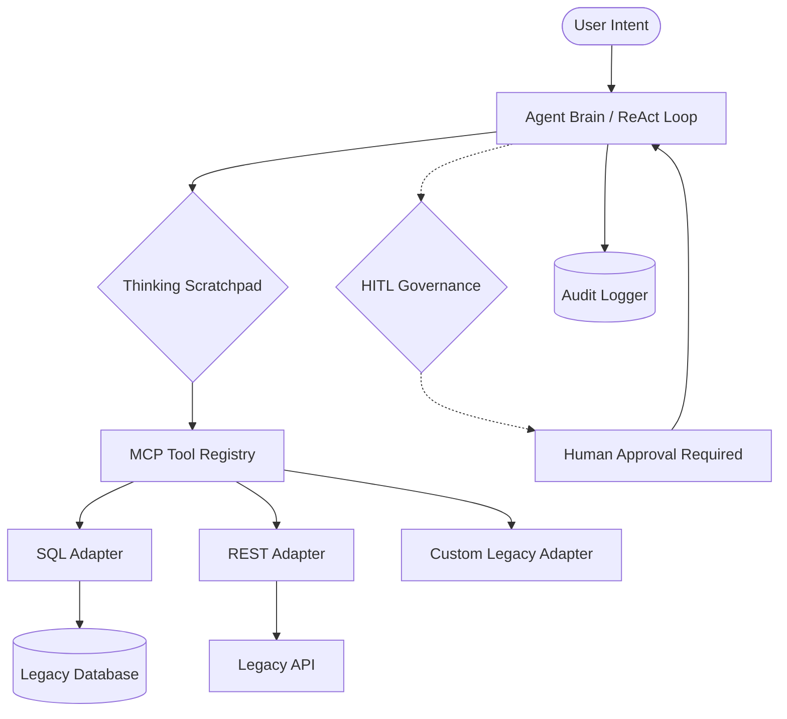

# The Agentic Bridge 🌉

> **"Intelligence without Migration"** — Unlock agentic capabilities in your legacy infrastructure without touching a single line of source code.

[](https://opensource.org/licenses/MIT)
[](https://www.python.org/downloads/)
[](https://modelcontextprotocol.io)

**The Agentic Bridge** is a non-invasive middleware platform designed to transform static legacy systems—databases, APIs, and monolithic applications—into autonomous, reasoning agents. By leveraging the **Model Context Protocol (MCP)** and a robust **ReAct (Reasoning + Acting) loop**, it allows enterprises to modernize their workflows with state-of-the-art AI while maintaining total control and security.

---

## 🚀 Key Features

### 🔌 Universal MCP Adapters
Seamlessly wrap any legacy data source. Our modular framework supports SQL (SQLite, PostgreSQL), RESTful APIs, and flat files, making them instantly discoverable by the "Agent Brain."

### 🧠 Dynamic ReAct Reasoning Engine
Powered by **Gemini 2.0 Flash**, our LLM-agnostic engine handles the complex *Observe -> Think -> Act* loop. It manages multi-step tasks across disparate systems with a transparent reasoning scratchpad.

### 🛡️ Governance & HITL Framework
Safety first. Define high-risk tools (e.g., `delete`, `pay`, `update`) that require explicit human approval via a unified control interface before execution.

### 📜 Audit & Observability
Every thought, action, and system observation is recorded in a persistent store. This "Black Box" recorder provides full compliance trails and simplifies debugging for complex agentic workflows.

### 🤖 Model Agnostic
Choose your brain. Easily swap between Gemini, GPT-4, Claude, or local Llama 3 models based on your specific performance, cost, or security requirements.

---

## 🏗️ Architecture Overview

The Agentic Bridge acts as a translation layer between the user's intent and the legacy systems' capabilities.



---

## 📂 Project Structure

- `src/`: Core implementation files.
  - `agent_brain.py`: The central ReAct reasoning loop.
  - `nav_mcp_adapter.py`: Navigation system MCP wrapper.
  - `weather_mcp_adapter.py`: Weather service MCP wrapper.
  - `audit_logger.py`: Persistent event logging.
- `product_strategy/`: Product vision, scope, and MVP definitions.
- `read_me/`: Educational resources and conceptual guides.

---

## ⚙️ Getting Started

### Prerequisites
- Python 3.9+
- A Google Gemini API Key (or your preferred LLM provider)

### Installation
1. Clone the repository:
   ```bash
   git clone https://github.com/your-repo/legacy-to-agentic.git
   cd legacy-to-agentic
   ```
2. Install dependencies:
   ```bash
   pip install -r requirements.txt
   ```
3. Configure environment variables:
   Create a `.env` file in the root directory:
   ```env
   GOOGLE_API_KEY=your_api_key_here
   ```

### Running the Demo
```bash
python src/legacy_integration_app.py
```

---

## 🛡️ Governance & Safety

In an enterprise environment, autonomy must be paired with accountability. The Agentic Bridge implements:
- **Tool-Level Restrictions:** Categorize tools by risk level.
- **Human-in-the-Loop (HITL):** Intercepts sensitive actions for manual review.
- **Traceability:** Detailed reasoning logs explain *why* an agent chose a specific action.

---

## 🗺️ Roadmap

- [ ] **V1.1:** Support for PostgreSQL and MySQL adapters.
- [ ] **V1.2:** Web-based Governance Console (Control Room).
- [ ] **V1.3:** Integration with local LLMs (via Ollama/vLLM).
- [ ] **V2.0:** Multi-agent orchestration for cross-departmental workflows.

---

## 🤝 Contributing

We welcome contributions! Please see our [Contributing Guide](CONTRIBUTING.md) for details on our code of conduct and the process for submitting pull requests.

## 📄 License

This project is licensed under the MIT License - see the [LICENSE](LICENSE) file for details.
